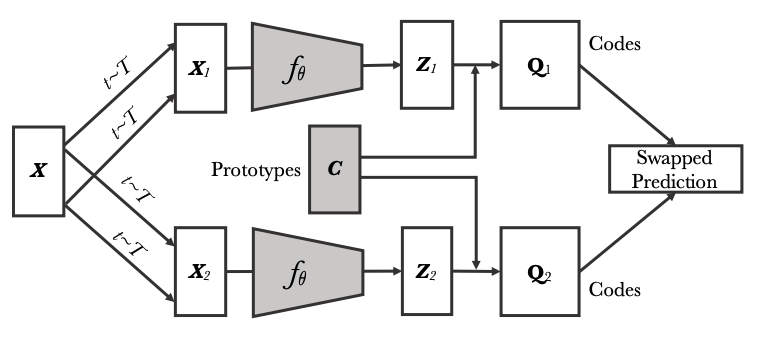

<div align="center">

# Domain Adaptation Implementation

A Tensorflow wrapper for Domain Adaptation (pretraining models)

</div>

## SwAV (Swapping Assignments between views)

SwAV is an efficient pre-training convnets. The algorithm learns learns representations by comparing transformations of an image, but it doesn't compute feature pairwise comparisons. The goal is to learn an embedding, such that semantically similar images are closer in embedding space. This approach use a clustering-based method, it is achieved through assigning the features to a prototype vector and passing it through Sinkhorn Knopp Algorithm. Thus prototype is learned by backpropagating the loss. To compare cluster assignments to contrast different image views, SwAV proposes a simple “swapped” prediction problem where the code of the view of an image is predicted from the representation of another view of the same image. The rationale here is if two views are semantically similar, their codes should also be similar. The features are learned by Swapping Assignments between multiple Views of the same image (SwAV).

SwAV proposes a multi-crop augmentation policy where an image is randomly cropped into n high resolutions crops and m lower resolution ones. Only the higher quality images are used for assignments, and the lower one are here to make the algorithm more efficient.





### Multi-crop dataset
This implementation provides an easy-to-use `SwaVDataset` object which takes a `tf.data` dataset and transforms it into a multi-crop one. 
You only have to feed some parameters:

```
dataset_or_path: Should pass either a path to files or a tf.dataset
size_crops: A list of size of crops exp: [224, 168] (The list should be in descending order)
nmb_crops: A list that is the same size of size_crops that gives the number of time each size should be duplicated exp: [2, 3]
min_scale_crops: A list of minimum scaling of a crop for each crop size exp: [.1, .12]
max_scale_crops: A list of maximum scaling of a crop each crop size exp: [1., .98]
b_s: Batch size
```

Initializing this object, create a `SwAVDataset.dataset_swavved` attributes of shape (b_s, crop_size, crop_size, 3).

### The Model
This implementation also provides a `SwAV` wrapper which makes training very easy.
The parameters are the following:

```
model: the tf.models.Model you want to pass (Resnet50)
p_d1: the dimension of the first layer of the prototype model
p_d2: the dimension of the projection layer of the prototype model
p_dim: the dimension of the prototype layer
normalize: a bool to normalize or not the projection layer
sinkhorn_iter: the number of iterations of the sinkhorn algorithm
epsilon: converge parameter of the algorithm
temperature: controling randomness of the predictions
crops_for_assign: list of indexes of the crops used for assignements (the first ones which are usually the higher resolutions)
```

Afterward, you can simply use the `fit` method passing the `SwAVDataset`, the `optimizer`and the `epochs`


